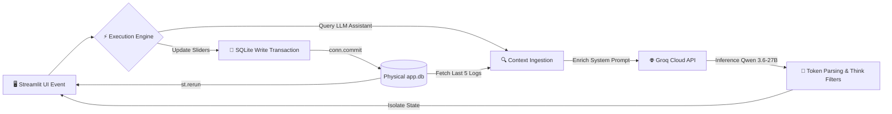

# 🗺️ Smart City Cluj-Napoca — Aplicație Operațională & Workflow Logic

Acest document descrie circuitul logic, tranzacțional și computațional al platformei Smart City. Structura urmează principiul separării responsabilităților (Separation of Concerns), izolând fluxurile de date pentru a garanta integritatea locală.

---

## 🔁 1. Pipeline-ul Tranzacțional de Date (IoT Ingestion Flow)

La fiecare ciclu operațional sau lansare a platformei, datele urmează un traseu liniar, asigurat de bariere de control statice și criptografice:

```mermaid
gantt
    title Circuitul Secvențial al Datelor IoT
    dateFormat  X
    axisFormat %s

    section Ingestie & Validare
    Inițializare Context (.env / Structură) :active, p1, 0, 10
    Scaffolding Bază de Date (Auto-Seeding)  :p2, after p1, 15

    section Securitate & Audit
    Barieră Autentificare Operator (SHA-256) :crit, p3, after p2, 20
    Evaluare Praguri Alerte & Cooldown 10s   :p4, after p3, 15
    Ingestie security_alerts.log            :p5, after p4, 10

    section Randare & AI
    Calcul Matrice Pearson & Extrapolare ML  :p6, after p5, 15
    Context-Aware Grounding (Inference LLM)  :p7, after p6, 20
```

### Detalii Computaționale pe Etape:
1. **Scaffolding Dinamic (`main.py` -> `run_automatic_seeding`):** Aplicația verifică existența `app.db`. Dacă fișierul este gol sau lipsesc tabele, rulează instant un proces `DROP` / `CREATE TABLE` tranzacțional, injectând coordonatele din Cluj-Napoca și configurările administrative (`temp_limit`, `noise_limit`).
2. **Intercepție Criptografică (`check_authentication`):** Intre textul introdus în interfața Streamlit și variabilele din `.env` se interpune motorul nativ `hashlib`. Verificarea se face în timp constant pentru a bloca atacurile de tip timing side-channel.
3. **Filtru Anti-Duplicare (`local_alerts.py`):** Valorile telemetrice live sunt evaluate în raport cu pragurile stocate în baza de date. Dacă o valoare depășește limita, se verifică timestamp-ul ultimei alerte din `security_alerts.log`. Dacă au trecut mai puțin de 10 secunde, scrierea pe disc este blocată pentru a preveni epuizarea spațiului de stocare (I/O flood prevention).
## 🧠 2. Ciclul de Viață al unei Cereri de Utilizator (User Request Lifecycle)

Atunci când un operator modifică parametrii din interfața grafică sau interoghează Asistentul Urban, platforma execută următorul circuit logic:

### Workflow-ul de Intervenție AI & Guardrails:
* **Context-Aware Grounding:** Atunci când asistentul inteligent pregătește un răspuns, el execută o interogare sincronă pe disc pentru a extrage ultimele 5 înregistrări de erori din jurnalul de audit urban și parametrii în timp real ai stației selectate.
* **State Isolation:** Rezultatele analizei LLM sunt salvate direct în structura `st.session_state`. Acest lucru izolează datele transmise de serverul AI în raport cu bucla automată de împrospătare a ecranului (UI refresh loop) la fiecare 5 secunde a framework-ului Streamlit, eliminând complet efectul de pâlpâire sau pierderea datelor din ferestrele de chat.
* **Modernized Layout Constraints:** Toate tabelele de date și hărțile Mapbox folosesc exclusiv noul standard arhitectural `width="stretch"` pentru a garanta adaptabilitatea dinamică pe rezoluții înalte (FullHD/4K), eliminând parametrii depreciați din versiunile anterioare.
