# 🏙️ Smart City Cluj-Napoca — IoT, AI & Urban Intelligence Platform

> **Portfolio-grade Python application combining local IoT telemetry, real-time urban monitoring, classical Machine Learning forecasting, local security log auditing, database synchronization, and data visualization.**

**Smart City Cluj-Napoca** is a modular Smart City / IoT platform designed to store, analyze, audit, and visualize urban telemetry from multiple monitoring locations in Cluj-Napoca without external infrastructure dependencies.

The project demonstrates an end-to-end local software engineering workflow:
Local IoT Ingestion → Native Database → Data Analytics → Classical Machine Learning → Local Logging → Security Audit → Interface Rendering

---
👉 Pentru detalii despre circuitul logic al datelor, vezi [ARCHITECTURE.md](ARCHITECTURE.md).

## 🔐 CONT DEMO PENTRU RECRUTORI / DEMO ACCESS

Pentru a evalua interfața operațională securizată Streamlit și modulele analitice avansate, utilizați următoarele acreditări pe pagina principală:

*   **Utilizator (Username):** `admin`
*   **Parolă (Password):** `cluj2026`

*Notă: Sesiunea este persistentă și protejată împotriva buclelor de execuție, fiind optimizată pentru mediul cloud de producție.*


## 🚀 Project Highlights

* **Programming:** Python 3.12 / 3.14 Compatibility (Local Portability Target)
* **Dependency Manager:** High-speed workflow automation via `uv`
* **Application & UI:** Streamlit (Neon Dark High-Contrast Framework)
* **IoT Engine:** Autonomous urban sensor network data processor
* **Database Access:** Native & Synchronous SQLite3 via SQLAlchemy 2.0 and `aiosqlite` (Zero network locks)
* **Data Engineering:** Pandas, NumPy
* **Applied AI Engine:** Dynamic integration with **Qwen 3.6-27B** via Groq Cloud API, replacing legacy structures for advanced operational reasoning.
* **AI Quality Control:** 8/8 automated test evaluations passed via **Promptfoo Testing Matrix** executed concurrently without cache.
* **Visualization Stack:** Mapbox Engine (Native Geospatial Mapping), Plotly Express Dark Templates.
* **Notification Layer:** Local Security Event Logger (`security_alerts.log`) with a strict 10-second anti-duplicate cooldown barrier.
* **Access Control:** Isolated local multi-page operator authorization core integrated with `.env` variables.
* **Static Analysis:** High-performance linting and formatting via Ruff.
* **Cryptographic Security Layer:** Zero-dependency `SHA-256` password hashing infrastructure using Python's native `hashlib`, enforcing cryptographic integrity for operator authentication and preventing plain-text exposure within configuration scopes.

---

## 🌆 What the Platform Does

The platform acts as a centralized urban control unit that continuously reads, stores, and evaluates environmental and traffic indicators for different areas of Cluj-Napoca.

### Monitored Parameters
* 🌡️ **Temperature** (°C) – Critical tracking for urban heat island identification.
* 🔊 **Noise level** (dB) – Environmental auditory pollution indicators.
* 🚗 **Traffic load** (%) – Automotive density matrix.
* 🌫️ **Air quality** (PM2.5 index) – Real-time particulate matter monitoring.
* 🌱 **Soil moisture** (%) – Automatic irrigation requirements tracking.
* 📍 **Sensor coordinates** (Latitude / Longitude mapped geospatially).

The telemetry is persisted locally in `app.db` and is instantly available to the multi-page interface (Dashboard, Settings, Analytics).

---

## 🏗️ Technical Architecture Diagram

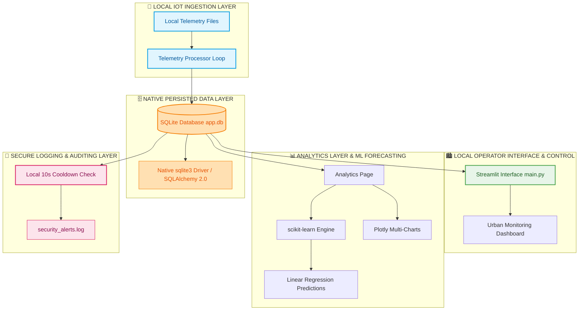

---
## 📁 Operational Gallery & Visual Ingestions (UI/UX)

Platforma include o interfață internaționalizată. Mai jos sunt screenshot-urile verificate din producție care validează funcționalitatea modulelor:

### 🔒 Operational Security & Core Dashboard
* **01. Secured Operator Login:** 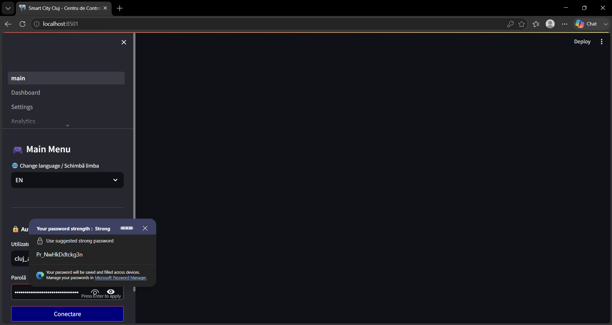
* **02. Centralized Control Panel:** 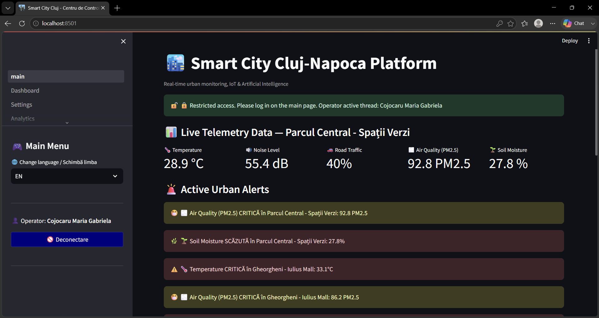
* **03. Industrial Audit Trail:** 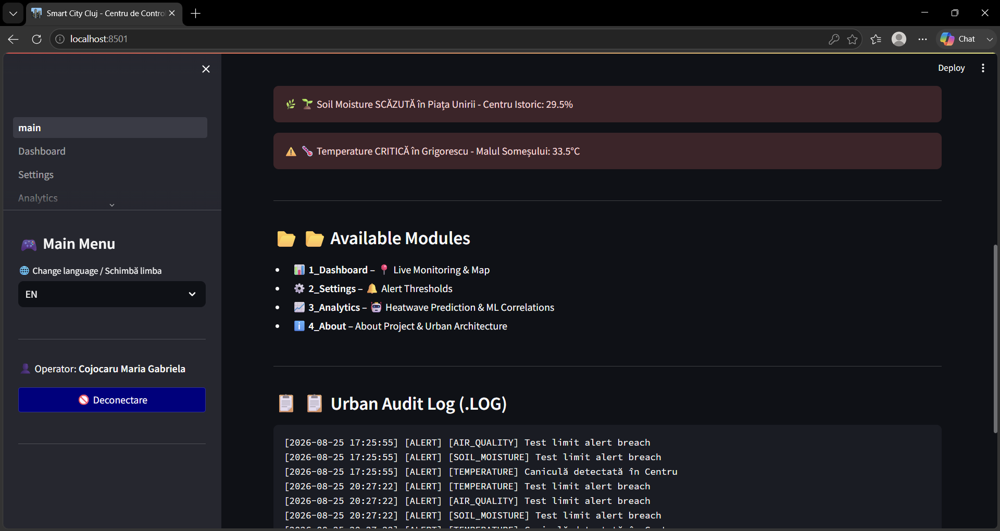
* **04. Multi-Language Synchronization:** 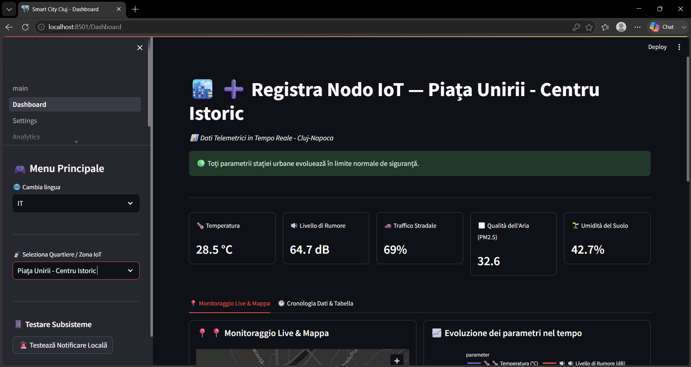
* **05. Mapbox Geospatial Engine:** 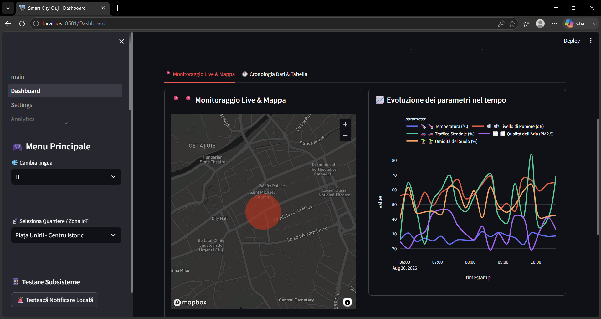
* **06. System Administration Panel:** 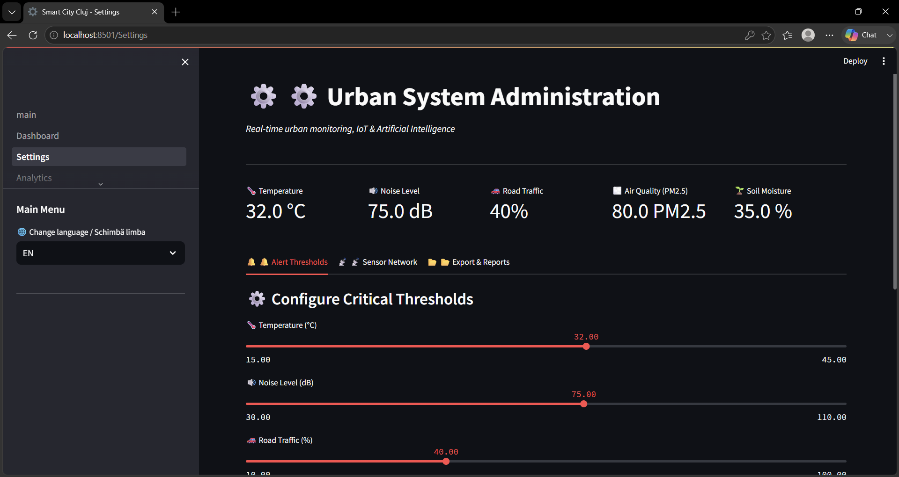

### 🔬 Applied AI & Machine Learning Forecasts (Qwen Engine)
* **07. LLM Reasoning Trace:** 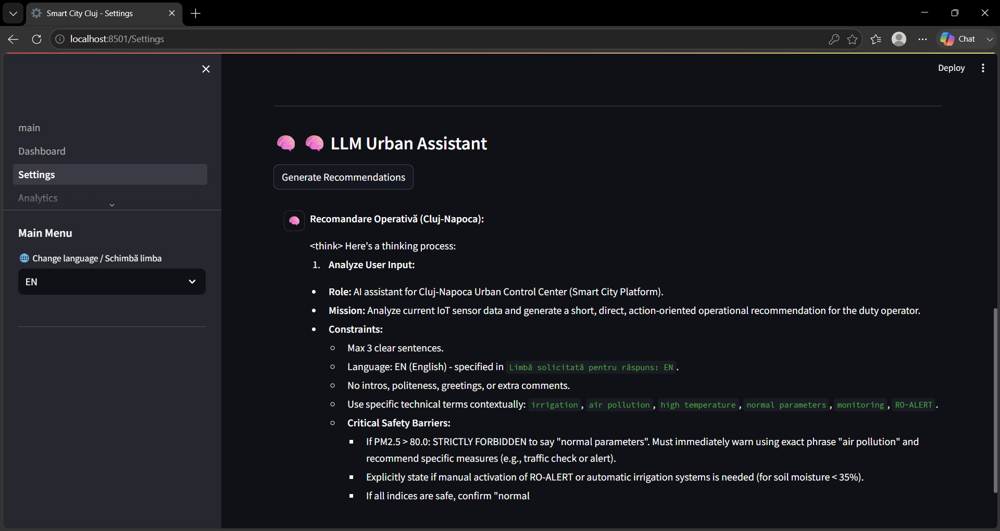
* **08. Pearson Statistical Matrix:** 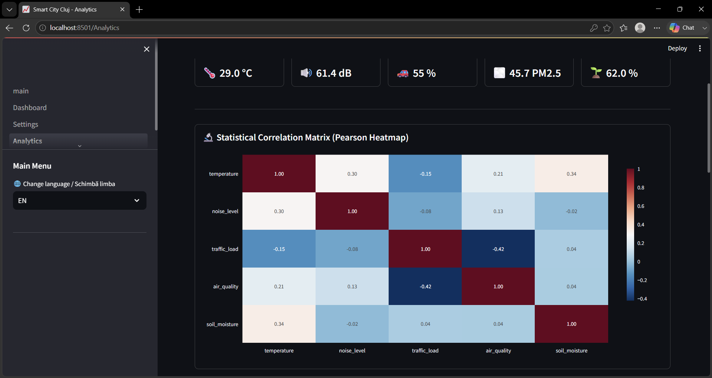
* **09. Time-Series Trends Plot:** 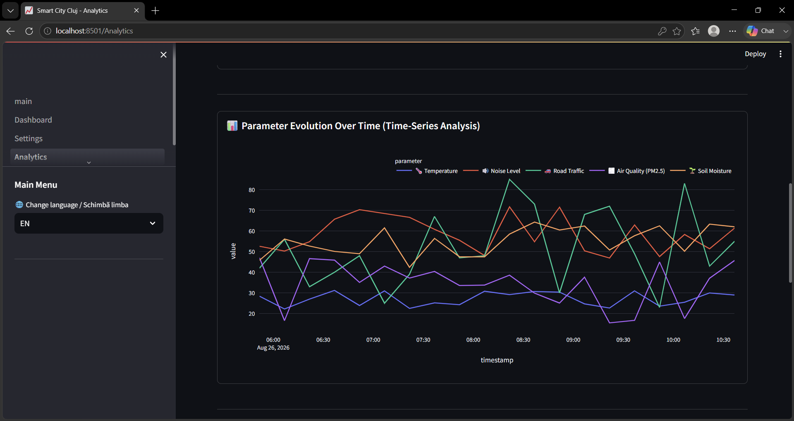
* **10. Temperature Linear Prediction:** 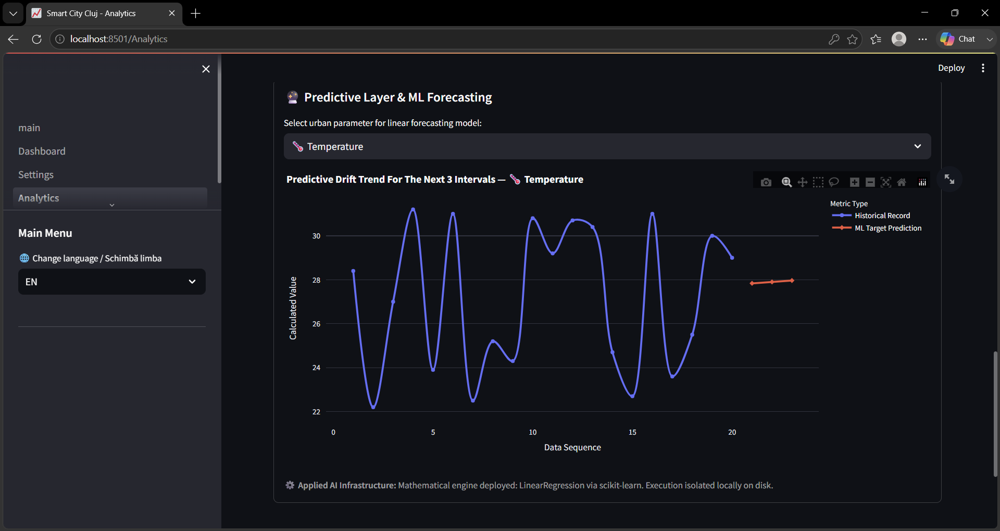
* **11. Road Traffic Predictive Drift:** 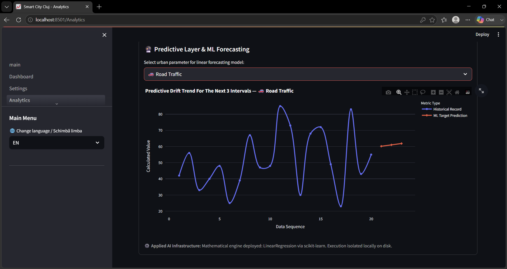
* **12. AI Context-Aware Guardrails:** 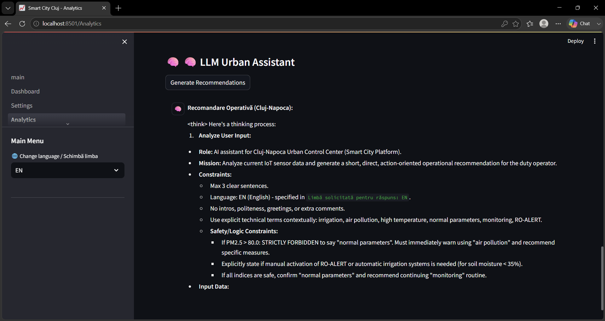

### 🏗️ Structural Architecture & Advisory
* **13. Core Capabilities Guide:** 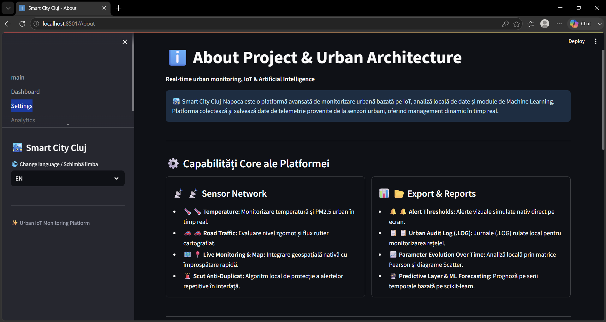
* **14. Multi-Tiered Layer Mapping:** 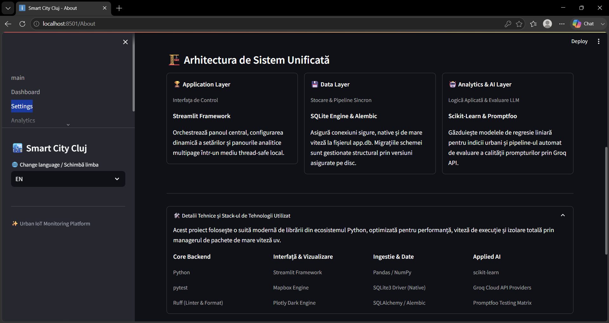
* **15. AI Grounding Portability:** 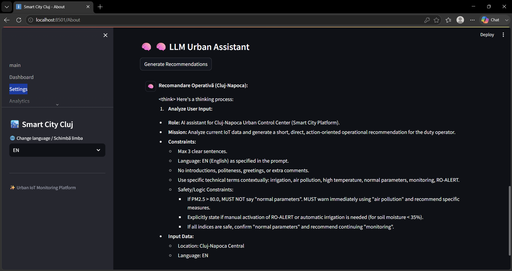
* **16. Control Panel Footer Ingestion:** 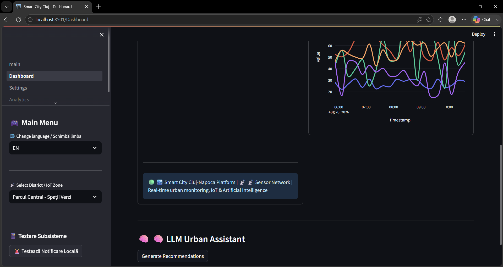


## ☁️ Cloud Development & GitHub Codespaces Infrastructure

The **Smart City Cluj-Napoca** platform is fully optimized for cloud-native development. Integration with **GitHub Codespaces** and devcontainers (`.devcontainer`) enables an instant browser-based runtime setup, bypassing local OS dependency issues or experimental Python conflicts.

### 🚀 Quick Launch in GitHub Codespaces
1. Navigate to your GitHub repository.
2. Click the green **Code** button and select the **Codespaces** tab.
3. Click **Create codespace on main**.
4. The system will automatically build the isolated container from `.devcontainer/`, configure the stable Python target, and launch your workspace in under a minute.

### 🐳 Environment Automation via Devcontainers
The setup within `.devcontainer/devcontainer.json` executes an automated initialization workflow:
- Pulls and spins up the official stable Python image on top of isolated Linux (Ubuntu).
- Exposes secure port `8501` for automated Streamlit graphical user interface forwarding.
- Installs the high-speed package manager `uv` and synchronizes all dependencies listed in `pyproject.toml`.

### 🔌 Start Command for Cloud Environments (Codespaces / Linux)
Once the Codespaces terminal becomes active, launch the application cleanly, avoiding Windows paths entirely:
```bash
uv run streamlit run main.py
```

---

## 🚀 Quick Start IoT Platform (Fully Automated Pipeline)

To validate system integrity (unit tests, automated LLM safety matrices via Promptfoo) and launch the graphical user interface within a single, local continuous stream, run the following optimized chain command in your terminal:

```powershell
uv run ruff format . ; uv run ruff check . --fix ; Get-ChildItem -Path . -Filter "__pycache__" -Recurse -Directory | Remove-Item -Force -Recurse ; if (Test-Path .pytest_cache) { Remove-Item -Path .pytest_cache -Force -Recurse } ; if (Test-Path .ruff_cache) { Remove-Item -Path .ruff_cache -Force -Recurse } ; if (Test-Path .promptfoo) { Remove-Item -Path .promptfoo -Force -Recurse } ; if (Test-Path promptfoo_cache) { Remove-Item -Path promptfoo_cache -Force -Recurse } ; uv run pytest -v -s ; uvx --with-requirements pyproject.toml promptfoo eval --no-cache ; uv run streamlit run main.py
```


## 🚨 Intelligent Alerting & Configuration Boundaries

The application validates live metrics against custom execution boundaries defined by administrators directly in the control panel.

### Mathematical Assertion Formula
The local alert engine calculates the system state boolean (A) using a strict conditional inequality for resources such as soil moisture (V_soil) vs the configured safety boundary threshold (P_soil):

* If V_soil < P_soil -> System State A = 1 (Critical Alert Triggered)
* Otherwise -> System State A = 0 (System Nominal)

If A = 1, the application triggers a critical localized visual alert card banner inside the user interface thread and dispatches the record to the `security_alerts.log` audit stream, honoring the strict 10-second cooldown barrier.

---

## 🤖 Analytics & Classical Machine Learning

The analytical engine operates with quick matrix calculations to determine environmental drifts.

### 1. Pearson Correlation Coefficient Evaluation
The platform computes a real-time heatmap correlation matrix to identify positive or negative linear dependencies between automobile density and air degradation using the standard coefficient formula:

r_xy = Covariance(x, y) / (StdDev(x) * StdDev(y))

### 2. Predictive AI Forecasting Model & Contextual Ingestion
* **Linear Regression Engine:** Leveraging `scikit-learn` Linear Regression, the application isolates historical metrics, computes the growth slope (y = b_0 + b_1*x), and plots the next 3 future prediction points natively on the Plotly charts.
* **Advanced Qwen Inference Pipeline:** Beyond classical regression, the platform utilizes the **Qwen 3.6-27B** model to generate administrative recommendations. The engineering prompt is enriched dynamically (Context-Aware Grounding) using the last 5 logs extracted from the physical `security_alerts.log` and the station's live parameters. Results are safely isolated inside `st.session_state` to withstand Streamlit's 5-second automatic UI refresh loop.
## 🔐 Security — Defense in Depth

The application enforces a layered information security approach to reduce the local threat landscape:
1. **Secret Isolation:** No hardcoded infrastructure paths or external credentials. Application environment tokens reside in isolated, clean `.env` blocks.
2. **Local Security Event Logger:** Utilizes an industrial `RotatingFileHandler` configured to cap logs at 5MB, preventing hard drive exhaustion attacks, combined with a 10-second cooldown guard.
3. **Data Integrity Isolation:** The telemetry query pipeline isolates database reads to protect against thread collision and database locks.

---
## 🔒 Cryptographic Credential Hardening (SHA-256 Pipeline)

To eliminate the risk of plain-text password exposure within the configuration layer, the platform incorporates a zero-dependency cryptographic verification pipeline. Instead of storing the actual administrative password, the `.env` configuration file encapsulates a secure **SHA-256 cryptographic digest (hash)**.

### 1. Architectural Security Blueprint
When an operator attempts authentication, the execution engine intercepts the plain-text entry, computes its mathematical fingerprint natively via `hashlib`, and performs a constant-time comparison against the isolated hash. If the `.env` file is accidentally compromised or committed to version control, the original password remains computationally irreversible.

### 2. Local Fingerprint Generation Script
Operators can generate safe cryptographic digests locally without transmitting credentials over external networks. Execute this high-speed, inline Python sequence within the terminal:

```bash
python -c "import hashlib; p = input('Enter target password: '); print('\nSecure Hash Output:\n' + hashlib.sha256(p.encode()).hexdigest())"
```

### 3. Hardened Environment Schema
Update your local, uncommitted `.env` file replacing the plain-text keys with the secure hash token generated by the script:

### 3. Hardened Environment Schema (.env.example)
Create a local `.env` file in the root directory of the project. Populate it using the generic structure below, replacing the placeholder values with your actual operational operational credentials:

```env
PLATFORM_ADMIN_USER=your_secure_admin_username
# Replace with the 64-character SHA-256 cryptographic digest generated by the local script
PLATFORM_ADMIN_PASS_HASH=8c6976e5b5410415bde908bd4dee15dfb167a9c873fc4bb8a81f6f2ab448a918
OPERATOR_FULL_NAME=Your Full Name
DATABASE_PATH=data/smart_city.db
```


## 📂 Project Structure

Below is the optimized architectural directory structure:
```text
Smart-City-Cluj-IoT/
│
├── app/                    # CORE APPLICATION DATA PACKAGE
│   ├── database/           # Mapped Synchronous Database Connections (SQLAlchemy 2.0)
│   └── ai/                 # Groq Provider & Visual Ingestions (Qwen Engine)
│
├── src/
│   └── utils/              # Local Auditing & Protection Utilities
│       └── local_alerts.py # Centralized Dispatched Security Handler (10s Cooldown)
│
├── pages/                  # Streamlit Multi-Page View Ingestions
│   ├── 1_Dashboard.py      # Real-Time Map & Trend Components
│   ├── 2_Settings.py       # Administration & Data Export Nodes
│   ├── 3_Analytics.py      # Core Correlation Plots & ML Forecasting
│   └── 4_About.py          # Corporate Architecture Tech Stack Guide
│
├── app.db                  # Native SQLite Production Database
├── security_alerts.log     # Local Security Audit Journal
├── main.py                 # Central Streamlit Application Entrypoint
├── pyproject.toml          # Package Configuration Metadata (uv managed)
└── .env                    # Local Environment Configurations
```

---
## 💻 Local and Cloud Execution Pipelines

To guarantee environment isolation and pristine development environments, choose the pipeline command set corresponding to your current operating system and terminal framework.

### 1. Windows VS Code PowerShell Pipeline (Local Environment)
Use this secure, unified sequence to format elements, drop operational artifacts, execute Python assertion tests, evaluate prompt matrices via promptfoo, and launch the application entrypoint cleanly:

```powershell
uv run ruff format . ; uv run ruff check . --fix ; Get-ChildItem -Path . -Filter "__pycache__" -Recurse -Directory | Remove-Item -Force -Recurse ; if (Test-Path .pytest_cache) { Remove-Item -Path .pytest_cache -Force -Recurse } ; if (Test-Path .ruff_cache) { Remove-Item -Path .ruff_cache -Force -Recurse } ; if (Test-Path .promptfoo) { Remove-Item -Path .promptfoo -Force -Recurse } ; if (Test-Path promptfoo_cache) { Remove-Item -Path promptfoo_cache -Force -Recurse } ; uv run pytest -v -s ; uvx --with-requirements pyproject.toml promptfoo eval --no-cache ; uv run streamlit run main.py
```


### 2. Linux / GitHub Codespaces Terminal Pipeline (Cloud Environment)
For cloud-native development environments inside Linux-based containers, execute the standard POSIX chain command:

```bash
# Step 1: Deep Cache Invalidation & Structural Formatting
uv run ruff format . && uv run ruff check . --fix && find . -type d -name "__pycache__" -exec rm -rf {} + && rm -rf .pytest_cache .ruff_cache .promptfoo promptfoo_cache src/*.egg-info && rm -f app.db cluj_smart.db security_alerts.log *.log

# Step 2: Database Provisioning, Verification and Full Application Multi-Stage Boot
uv run python seed_db.py && uv run pytest ai_tests/test_alerts_offline.py -v -s && uv run npx promptfoo eval --no-cache && uv run streamlit run main.py
```


## 🔎 ATS Keywords Registry

Python, Applied AI, Machine Learning, Data Engineering, Data Analytics, Python Backend Development, Backend Engineering, Pearson Correlation, Regression Matrix, Linear Regression, scikit-learn, Pandas, NumPy, SQL, SQLite, SQLite3, SQLAlchemy 2.0, aiosqlite, uv, Streamlit, Plotly Express, Mapbox Engine, Geospatial Heatmaps, Data Visualization, Industrial Logging, Security Audit, Local Isolation, Environment Variables, Windows PowerShell, Separation of Concerns (SoC).

---

## 👩‍💻 Author & Project Engineering Framework

* **Author:** Maria Gabriela Cojocaru
* **Professional Focus:** Applied AI Engineer | Python Backend Developer | Machine Learning Engineer
* **Core Design Principle:** Build local data pipelines, ensure environment portability, protect against dependencies, and write clean, auditable code.


